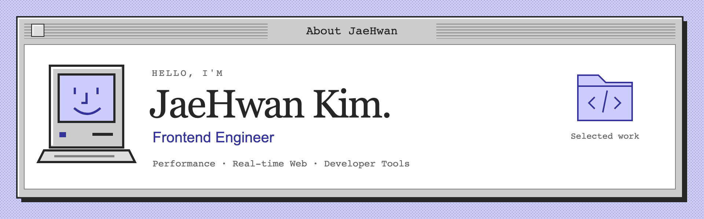

  <a href="https://jaehwankim.dev"><b>Portfolio ↗</b></a> &nbsp; · &nbsp;
  <a href="https://blog.jaehwankim.dev">Blog ↗</a> &nbsp; · &nbsp;
  <a href="mailto:ahhancom@gmail.com">Email ↗</a>

 

<h3>김재환입니다.</h3>

웹 서비스의 <b>성능과 안정성</b>을 개선하고, 해결 과정에서 얻은 기준을 팀에 남깁니다. B2B CRM부터 실시간 영상·로봇 제어까지, 브라우저와 맞닿은 다양한 제품을 만들어 왔습니다.

<h3>해결해 온 문제</h3>
<table>
<tr><td width="180"><b>21s → 1.6s</b> 인스타겟 LCP</td><td>실제 노출 순서에 맞춰 번들·렌더링·이미지 로딩 우선순위를 조정했습니다.</td></tr>
<tr><td><b>누수율 약 60배 감소</b> Next.js SSR</td><td>2년간 원인을 찾지 못했던 메모리 누수를 재현하고, Recoil의 SSR GC 누락을 규명했습니다. <a href="https://techblog.herrencorp.com/34f48de8-e0ea-8028-abce-dc1c977602c2">추적 과정 ↗</a></td></tr>
<tr><td><b>팀의 설계 기준으로</b> 도메인 중심 구조</td><td>28회의 스터디와 2개월의 논의를 팀 표준과 설계 리뷰 프로세스로 연결했습니다.</td></tr>
</table>

<h3>만드는 것</h3>

<b><a href="https://github.com/jxxh204/opentask">opentask ↗</a></b> 여러 Claude Code 에이전트를 독립된 작업 공간에서 실행하고 관제하는 데스크톱 앱. Developer tools · AI agents · Git worktrees

<b><a href="https://jaehwankim.dev">Mac OS 9, on the web ↗</a></b> 클래식 Mac 데스크톱을 웹으로 옮긴 포트폴리오와 블로그. <a href="https://github.com/jxxh204/portfolio">코드 보기</a> Next.js · Notion · Cloudflare Workers

<b><a href="https://github.com/jxxh204/NeowFocus">NeowFocus ↗</a></b> 지금 집중할 한 가지 일만 보여주는 macOS 뽀모도로 앱. <a href="https://apps.apple.com/kr/app/neowfocus/id6751244958">App Store</a> macOS · Focus · Productivity

<h3>글과 발표</h3>
<ul>
<li><a href="https://yozm.wishket.com/magazine/detail/3283/">사수에 기대지 않는 성장법</a> — FECONF 2025 라이트닝 토크 · 요즘IT</li>
<li><a href="https://techblog.herrencorp.com/25d48de8-e0ea-80e8-9bee-fc2b387c21fa">27명·14개 팀이 함께한 전사 AI 해커톤</a> — 기획과 운영 후기</li>
</ul>

더 보기 — 경력과 작은 실험들

 

<b>헤렌</b> 2024– · B2B 뷰티 CRM, 인플루언서 마케팅 플랫폼 <b>팀그릿</b> 2021–2023 · 실시간 미디어, 원격 로봇 제어 <b>130T</b> 2020–2021 · 로봇 교육 소프트웨어

<ul>
<li><a href="https://github.com/jxxh204/esp32-webrtc-cam">esp32-webrtc-cam</a> — ESP32 카메라 영상을 브라우저로 스트리밍</li>
<li><a href="https://github.com/jxxh204/marty-ilbo">marty-ilbo</a> — 매일 아침 받아보는 개인 일간지</li>
<li><a href="https://github.com/jxxh204/claude-code-monitor">claude-code-monitor</a> — Claude Code 사용량 데스크톱 위젯</li>
</ul>

TypeScript · React · Next.js · WebRTC 더 자세한 이야기는 <a href="https://jaehwankim.dev">jaehwankim.dev ↗</a>

